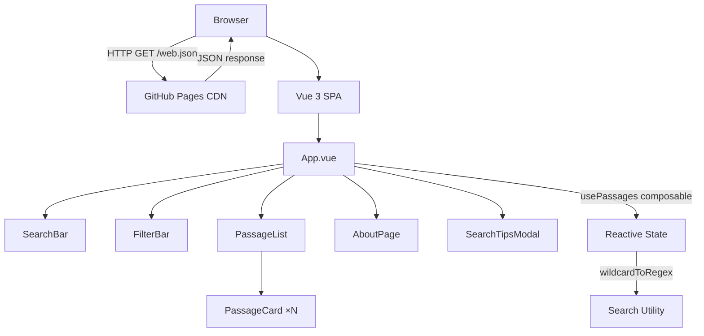
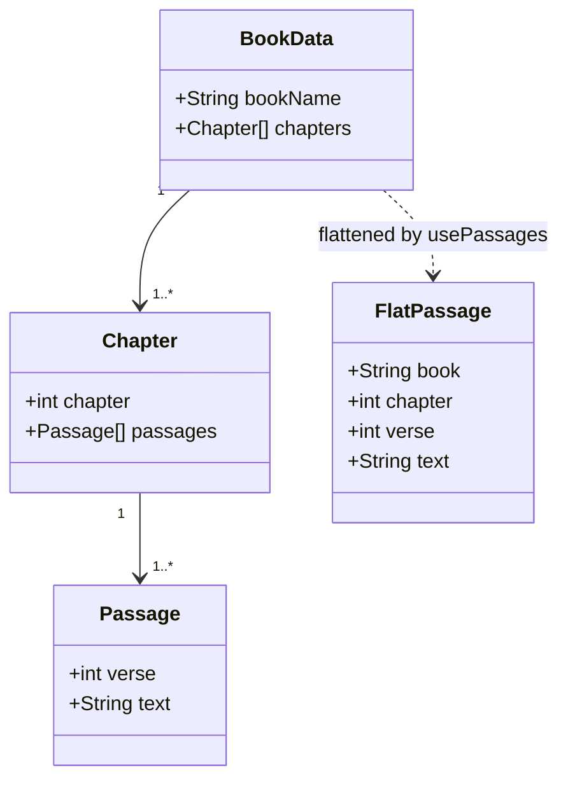
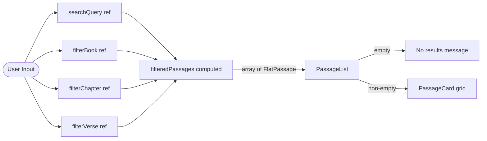
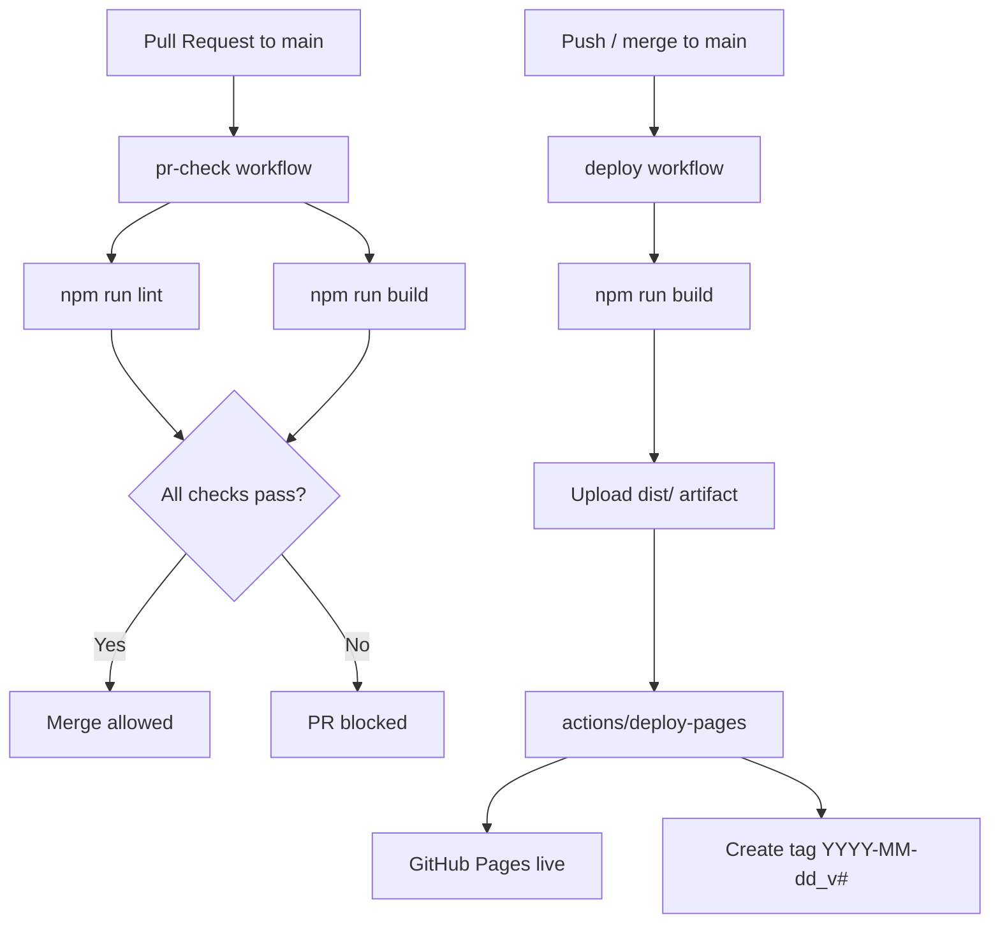
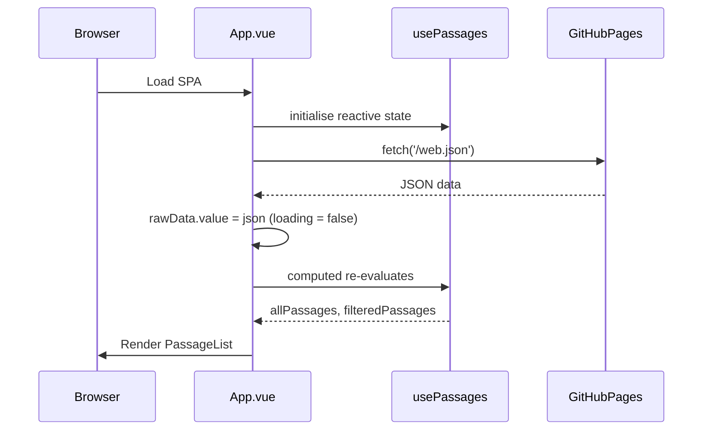

# Technical Specifications

This document describes the architecture and behaviour of the FindJes.us front-end application using UML diagrams rendered with MermaidJS.

---

## 1. Application Architecture



---

## 2. Data Model



---

## 3. Search & Filter Flow



---

## 4. Wildcard Search Algorithm

```mermaid
flowchart TD
    Start([Input: pattern, text]) --> HasWC{Pattern contains\n* ? # [ ]}
    HasWC -->|No| Sub[Case-insensitive\nsubstring match]
    HasWC -->|Yes| Conv[wildcardToRegex:\nreplace * → .*\nreplace ? → .\nreplace # → \\d\nreplace [!…] → [^…]\nescape other chars]
    Conv --> RE[RegExp]
    RE --> Test[regex.test text]
    Sub --> Result([true / false])
    Test --> Result
```

---

## 5. CI/CD Pipeline



---

## 6. Component Lifecycle


